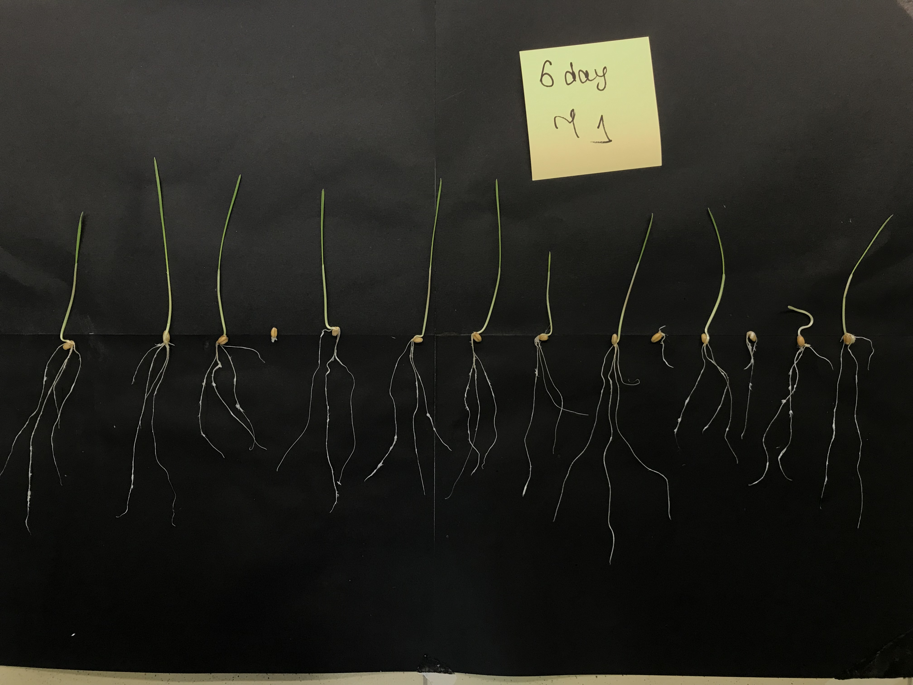
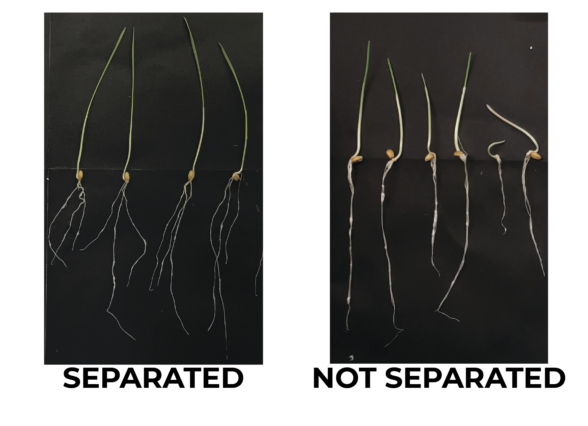
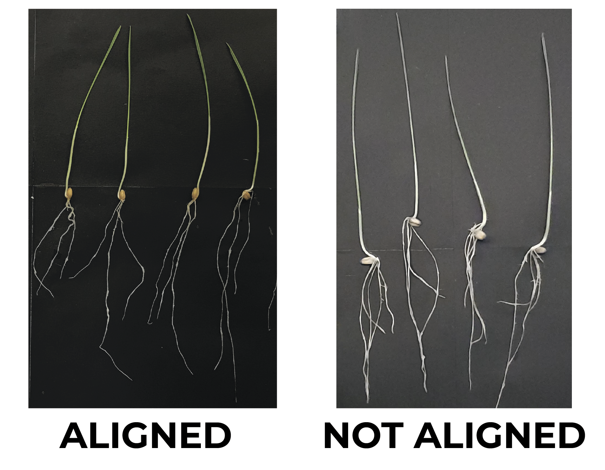

#  Protocol for  image acquisition

### Materials and Equipment:

* Plants under study
* Black mat background (42 cm x 60 cm was used)
* Contrast paper sticker of known size (79 x 79 mm was used)
* Laboratory table with sufficient lighting
* Any digital camera, including in-built in mobile phones (12 - 16 MP smartphone cameras were used)
* Tripod (optional)

### Procedure:
Write the plant group name on the paper sticker (just not to confuse photos)
Place plants and paper sticker on black mat background as shown in the example below:

  

### Important:
To achieve correct object recognition:
1) the seedlings should be aligned along the seeds and consistently oriented;
2) neighboring plants must not cross each other;
3) the paper sticker should be placed above the sprouts.

To achieve most accurate measurements:
1) all roots should be thoroughly split from each other to ensure their maximum visibility for the camera,
as in the example below:

  

2) plants should be aligned along the seeds as in the example below:

  

Optimize exposure to exclude excessively bright spots and take an image (automatic adjustment is recommended).
Visually ensure that the image has sufficient sharpness.
