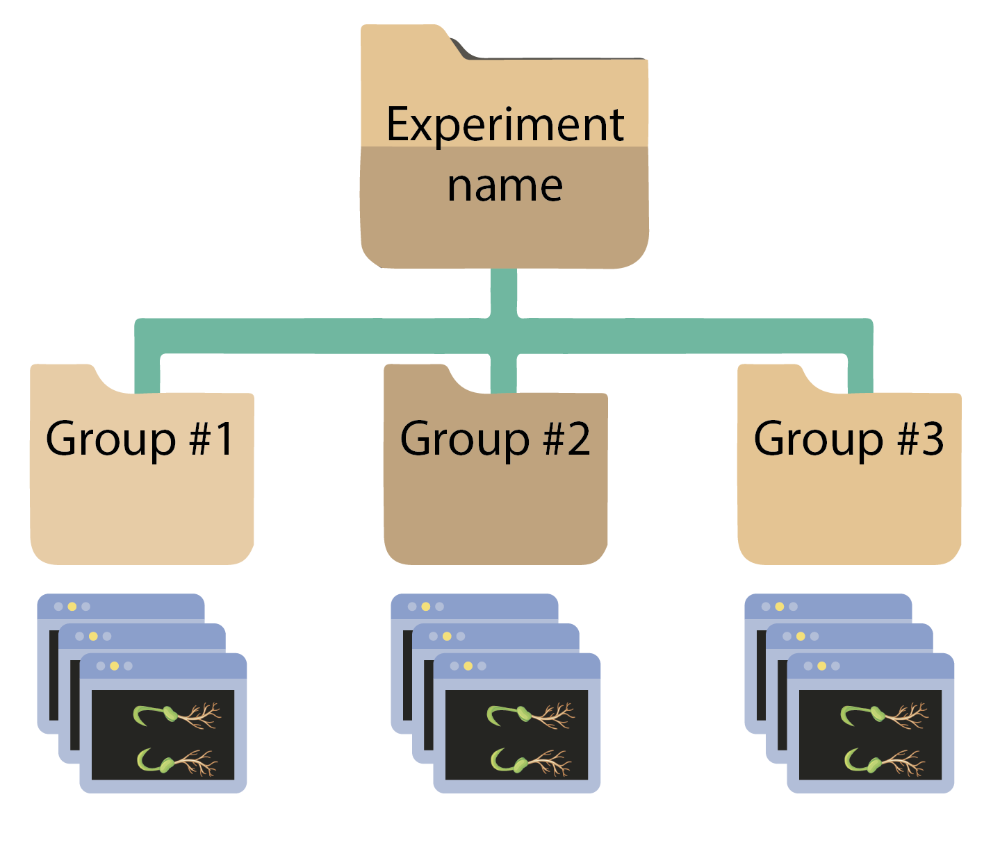
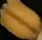
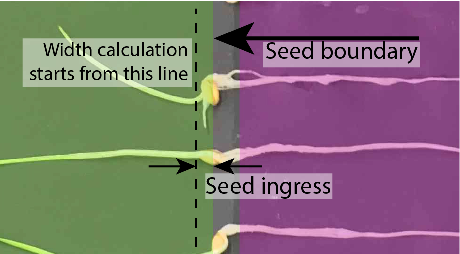
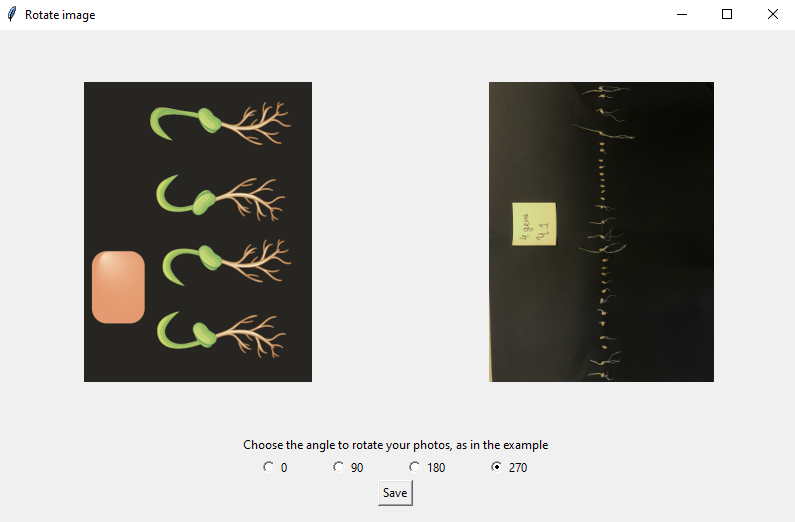
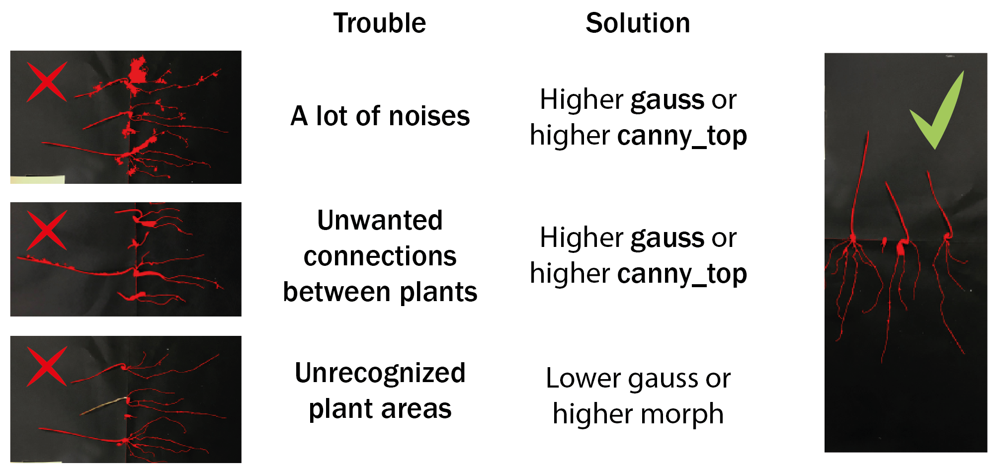
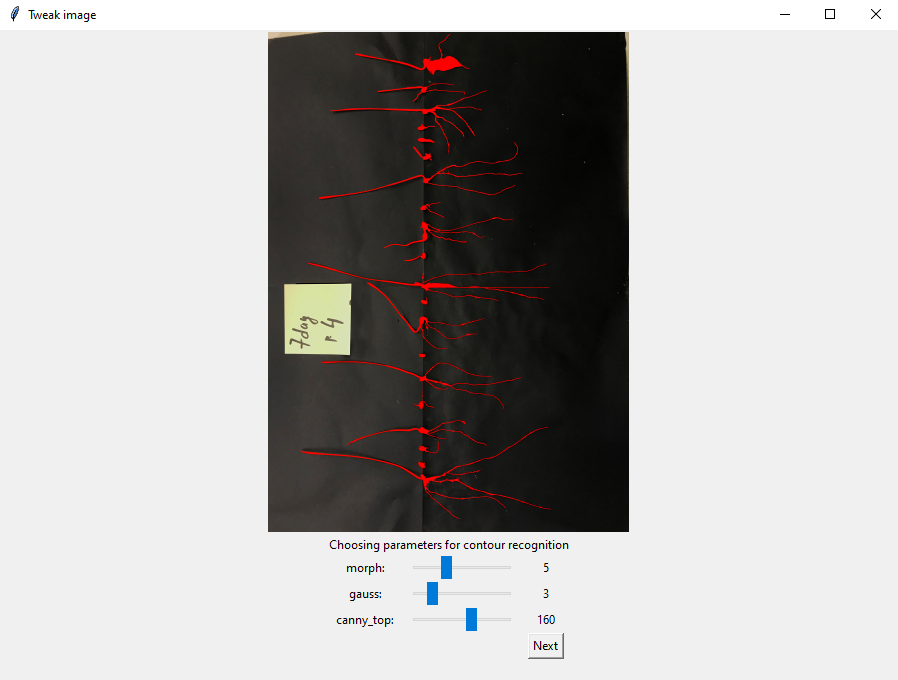
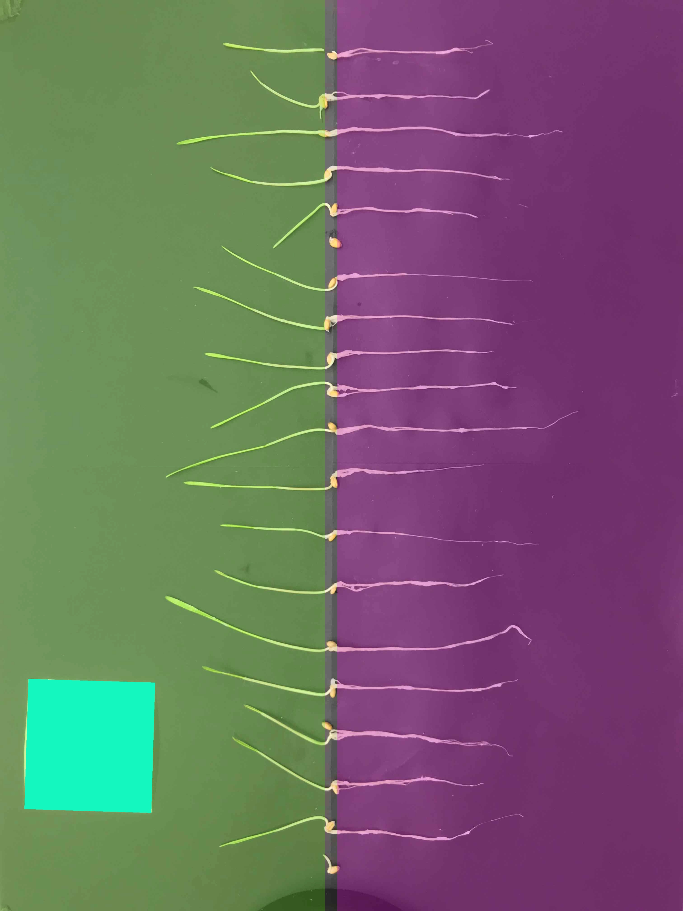
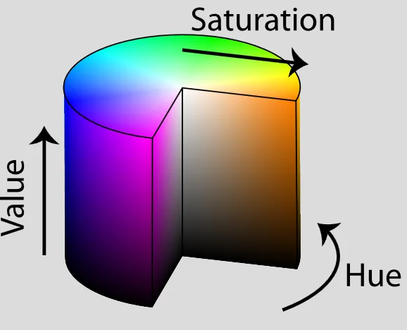
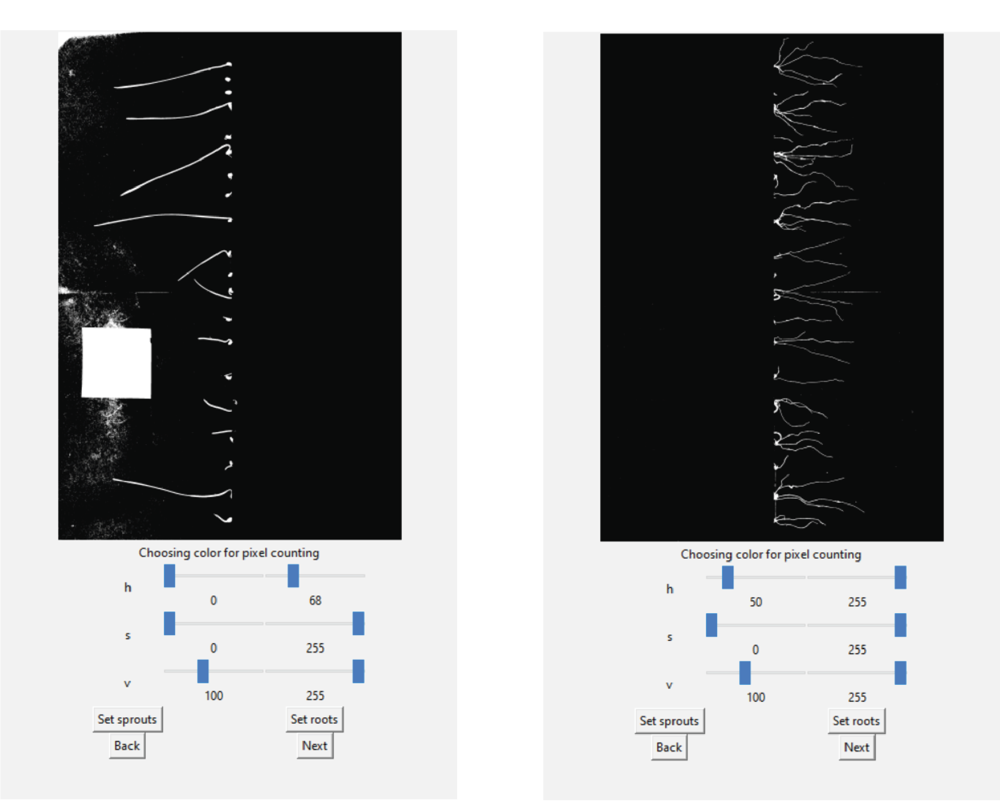
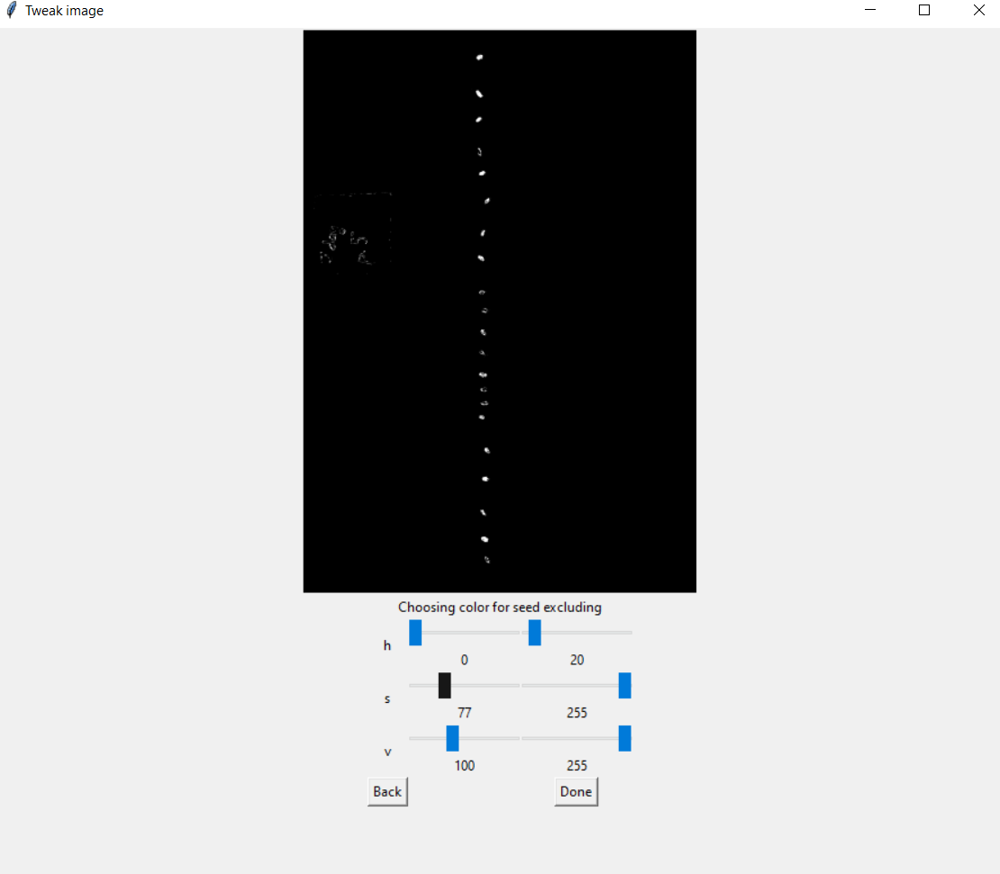

# Expanded Morley User Guide

Table of contents
=================

<!--ts-->
   * [Before running morley](#Before-running-morley)
   * [GUI usage](#GUI-usage)
      * [Launch](#Launch)
      * [Settings](#Parameters-setting)
        * [Rotation](#Rotation)
        * [Contours recognition](#Contours-recognition)
        * [Color ranges](#Color-ranges)
   * [CLI usage](#CLI-usage)
   * [Output](#Output)

<!--te-->

## Before running Morley
Prepare a directory with input photos. Folders with photos must have a certain structure:
the head folder contains subfolders named after the plant groups to be compared.
Head folder must be selected as the “Image directory”. Output file names will start with the head folder name.
Names of subfolders will be used as group labels in visualisation of statistical analysis.
Also prepare a seed template: a photo containing a seed only (cropped from a plant image).

<p align="center">

</p>

 <p>
   
 </p>


Ensure the seed image has the same resolution, not higher than the original photo,
do not use programs that can increase the resolution (for example, Photoshop), just cut a seed from any image using
a simple image editor (for example, Paint). We recommend you to choose a seed not covered by the roots of the plant
or turned in a strange way (see an example on the left).
Cut the image as close to the edges of the seed as possible.


## GUI usage:

### Launch
 Run `morley` command on the command line (or in Anaconda Prompt).

<p align="center">

</p>

*For quick start, download the [example data](../photos.zip), or select your own photos.
To test the program you can run it using bigger photo sets placed here: https://github.com/dashabezik/plants*

### Parameters setting
- Select the head directory with folders containing input photos as input directory.
- Select file with seed template.
- Select output directory.
- Set paper sticker size in $mm^2$, value = width (mm) x length (mm), and germination threshold in mm
  (seedlings with both sprout and root lengths below that threshold will be counted together with non-germinated seeds).
- Seed margin width. The margin from the seed boundary for calculating the width of a plant parts is used to avoid including the seed in the width calculation . The value is a persent of the width of the seed template, the value of the margin will be calculated as follows:

$$
\begin{aligned}
Margin =\dfrac{\text{seed template width}\cdot \text{the value you've entered in \\%}}{\text{100}\\%}
\end{aligned}
$$

<!-- <p>
  
</p>
 -->
*For large seeds and short sprouts, it is recommended to take a value of 10% or less; for small seeds, it is recommended to take a value of 100%. For large seeds whose parameters are comparable to the length of the seedlings, a large margin may lead to the exclusion of a large part of the seedling from calculations. For long seedlings and small seeds, in comparison with the parameters of seedlings, it is recommended to completely avoid seed inclusion by setting the full width of the seed,  by setting the margin parameter 100.*

  For the example dataset, use 6241 for paper size in $mm^2$, indent value 100 for wheat datasets and 10 for the peas dataset and any germination threshold you prefer.
  Germination threshold is a parameter for evaluating germination rate.
  
<br clear="left"/>

#### Rotation
Rotate images by clicking the “Rotate image” button.
Select the angle so that the location of the objects and the sprout-root orientation correspond to the schematic image on the left.

<p align="center">

</p>

  >**NOTE:** For correct processing, the paper sticker should be the most left contour,
  the seeds must form a vertical line in the center, and the shoot and the roots must be on the left and right
  from that vertical line, respectively. All the original photos should have the same orientation of sprouts and roots.

After setting the rotation angle, all the photos will be properly rotated, including the seed template image.


#### Contour recognition

Click the "Recognition settings" button to set parameters for plant, root, sprout and seed recognition.
Initial parameters, that on average should be suitable for any dataset, are set by default.

At this step your goal is to find the values of the parameters to achieve covering plants with contours
and avoid their merging. Initial values of the parameters are set, you should just fix them a little bit if it is needed.
See the picture below to understand possible problems*.

<p align="center">

</p>

\* *The parameter values for these pictures are chosen to be extreme.
When choosing options, the appearance of the contours will change less dramatically.*

  >**NOTE:**
  >What are the blurring parameters?
  >
  >‘morph’ is the size of structuring element for morphological transformation,
  >
  >‘gauss’ is the parameter of gaussian blurring,
  >
  >‘canny_top’ is the threshold for contour identification: any edges with intensity gradient more than ‘canny_top’ are detected as edges

Move the trackers to achieve the best recognition of whole plant contour:

<p align="center">
  
</p>

#### Color ranges

Morley uses the HSV color coding. The window displays 6 trackers:
lower and upper bounds for each of the 3 encoding components (h, s, v).
The result of the selection will be the color range of pixels that correspond to the object that we want to highlight
in the picture. The window also shows the binary mask of the photo:
white pixels where the image pixel falls into the selected range, black where pixels do not fall into the range.
Your task at this stage is to choose 2 ranges (for sprouts and for roots) that will successfully display the desired objects.

<p>
  
</p>

For clearer separation of roots from sprouts, internally Morley will color the image in "blocks":
a green block for sprouts and a pink one for roots, so the hue (h) for roots and sprouts lies in distinct ranges
(roots - (125, 165) or wider and seedlings - (20, 55) or wider).

At this stage, the saturation parameter (s) does not affect anything
(so far we have not met such plants or photographs in the course of work),
therefore its limits cover the entire range (0.255).

The brightness parameter (v - value, or brightness) selects only light areas to exclude the dark background,
so its approximate values range from 100 to 255.

<p>
  
</p>

<p>
  
</p>

<p>
  
</p>


<br clear="left"/>

<p>
  
</p>

When you get to this tab, the default values for the color components of the **roots** are displayed.
Customize them or leave them as they are and click the "Set roots" button on the right.
Next, you need to choose a color range for the sprouts. To do this, move the hue sliders to a range of yellow-green hues
(for example, from 0 to 60). At this point, the exact numbers are not so important, because the shades are spaced
in hue into non-overlapping ranges. Set the hue range so that the sprouts are clearly visible and click "Set sprouts".

> **NOTE:**
> Keep in mind that internally Morley is dealing with a block-colored picture like the one shown above, but what you see
> is a binary mask where white shows the parts of the image that fit into the currently set HSV ranges.

<br clear="left"/>

<p align="center">

</p>

The next step, seed segmentation is quite similar to the previous one.
Here your goal is to find the color range for the seeds.
The window displays the same trackers and a **binary mask for an uncolored photo** (without block coloring).
You should now choose the range for the natural seed color.
The default parameters are selected for yellow seed (seeds of wheat and peas, that were used are yellow).

> Hue has only a yellow range (0, 20). The top value is 20 to exclude green pixels of sprouts.
> Saturation scale has a range (100, 255) to exclude white unsaturated pixels of roots and sprouts.
> Brightness scale has a light range (100, 255) to exclude the dark background and in some cases you can increase
> the bottom value to exclude some roots and sprouts areas.

<p align="center">

</p>

_____________________

Press the ‘RUN’ button to start processing. Program has accomplished evaluation when progress bar shows 100%
and logging window will notify you when the search is over.

## CLI usage

You can use Morley via a command-line interface. To run Morley CLI run `morley` commnd with arguments.
The main argument is a config file, which you can obtain from the GUI and edit manually as needed.

```
morley C:\Users\dasha\plants\set1.json
```

You can add extra parameters, for example to use one configuration file for different datasets use additional `-i`, `-t`
and `-o` parameters, which override the settings specified in the file.

Run `morley --help` in the terminal to get full information about CLI parameters:

```
morley [-h] [-i INPUT] [-t TEMPLATE] [-o OUTPUT_DIR] [-r {0,90,180,270}] [-a PAPER_AREA] [-g THRESHOLD] config

Morley CLI: run a Morley analysis in headless mode.

positional arguments:
  config                A JSON file with settings. You can obtain one by saving settings from GUI mode. Other
                        arguments override the values in config.

optional arguments:
  -h, --help            show this help message and exit
  -i INPUT, --input INPUT
                        Input directory.
  -t TEMPLATE, --template TEMPLATE
                        Template file.
  -o OUTPUT_DIR, --output-dir OUTPUT_DIR
                        Output directory.
  -r {0,90,180,270}, --rotation {0,90,180,270}
                        Input photo rotation.
  -a PAPER_AREA, --paper-area PAPER_AREA
                        Paper area, mm^2.
  -g THRESHOLD, --threshold THRESHOLD
                        Germination threshold, mm.
```

## Output
The output files can be found in the output directory. Morley generates the following files:

- CSV tables with p-values<sup>1</sup> corresponding to all pairwise comparisons between sample groups,
  the calculated germination efficiency<sup>2</sup>, sprout and root lengths<sup>3</sup>,
  total plant areas and the summary table with all digital measurements<sup>4</sup>.

- figures characterizing distributions of measured plant sizes, bar plots with mean values and standard deviations,
  and heatmaps visualizing the conclusions on statistical significance of the morphometric changes.

> 1. ***Statistical analysis.*** Each sample group is tested for Gauss distribution using the Shapiro-Wilk test,
> with a p-value threshold of 0.05. Next, the null hypothesis that the means for two groups are equal is tested
> using either parametric Unpaired T-test or nonparametric Mann-Whitney test, depending on the results of the Shapiro-Wilk test result.
> The p-value below 0.05 is used as default criterion for rejecting the null hypothesis.
> 2. ***Germination efficiency.*** Germination efficiency is calculated as the ratio of the number of plants
> with the length of roots and sprouts above the germination threshold (simultaneously) divided by the total number of plants.
\[1-\dfrac{NG}{TN}\]
where NG - number of non-germinated seedlings, TN - total number of plants. 
> 4. ***Root length***. The programm calculates two parameters for roots: "root sum" and "root max".
> The first parameter is a plant total root length.
> The second parameter is the length of the longest root of a plant.
> 5. ***Tables***. Tables with individual parameters: a table in which the columns are the names of the groups,
> and the rows are the plant number, the values are presented in $mm$ for lengths and in $mm^2$ for area.
> There may be gaps in this table, such situations mean that this parameter for a particular plant is null,
> which does not mean a null value for another parameter (for example, the plant already has a root, but does not yet have a sprout).
> Thus, you do not lose information about the correspondence of one parameter to another.
> The summary table is a table, the columns of which contain all the parameters for each photo
> (therefore, the number of rows in each column is the number of plants in this photo).
