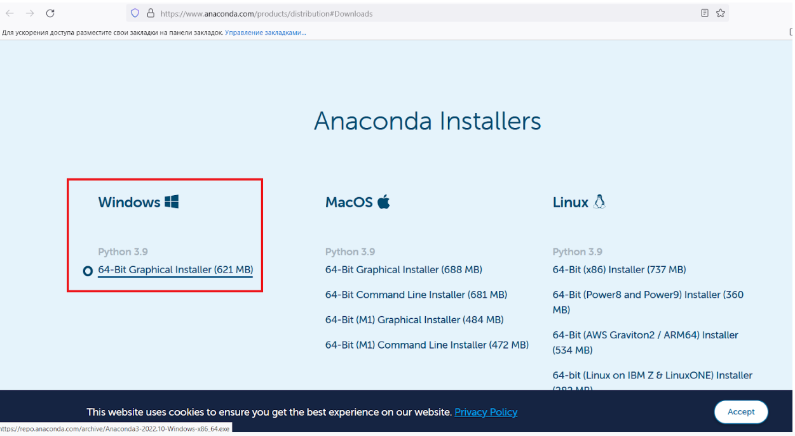
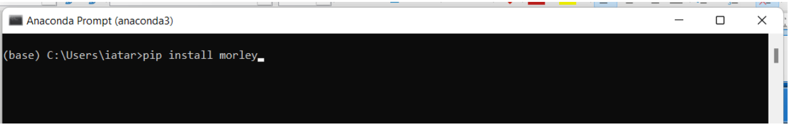
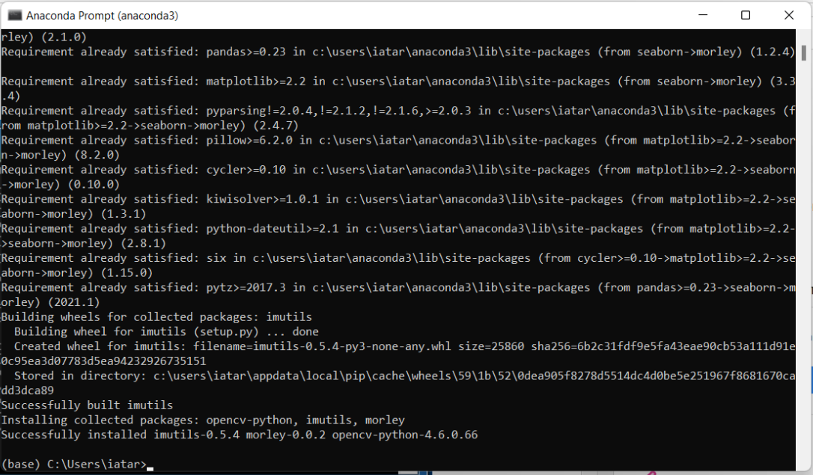
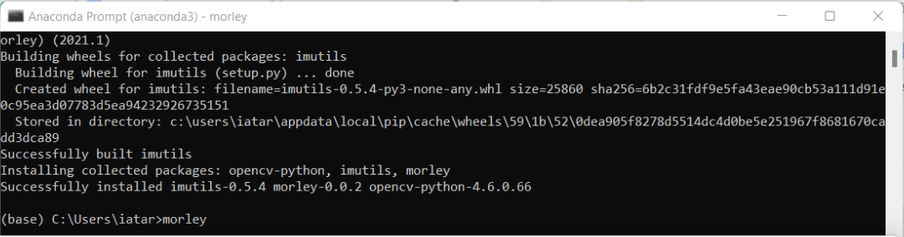

# Preinstallation and installation


Table of contents
=================

<!--ts-->
   * [Installation](#Installation)
      * [Python installation](#Python-installation) 
      * [Morley installation](#Morley-installation)
   * [Launch](#Launch)
<!--te-->


## Installation
### Python installation
*The following python installation guide is for Windows users*
1. MORLEY GUI requires Python 3.9 or newer. The easiest way is to install it as a part of the Anaconda environment. Download .exe file from https://www.anaconda.com/products/individual#Downloads

<p align="center">

</p>


2. Install Anaconda running the downloaded .exe file
3. Together with Anaconda, the Anaconda Powershell Prompt has been installed, which has a python package installer called pip. Type “Anaconda Powershell Prompt” in the search area of the “Start” menu and click on an application called Anaconda Powershell Prompt. This action will run the command line window.

### Morley installation

4. To  install MORLEY, type in Anaconda Prompt window the command and press “enter”:

```
pip install morley 
```  
<p align="center">

</p>

5. After successful installation you will see:
<p align="center">

</p>

## Launch

1. To open MORLEY GUI, type morley in command line and press “enter”

<p align="center">

</p>

2. After that, the window with MORLEY GUI will be opened:

<p align="center">

</p>
